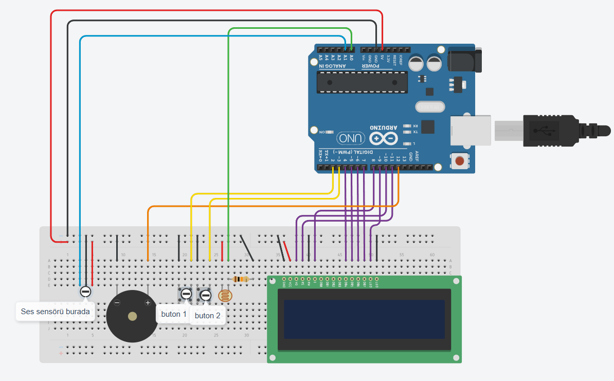

# Zomodoro: Zeynep'in Pomodoro Zamanlayıcısı

Zomodoro, kızım Zeynep için özel olarak tasarlamış bir pomodoro zamanlayıcısıdır. Bu proje, belirli aralıklarla çalışma ve dinlenme sürelerini yöneten ve Arduino Nano ile çeşitli sensörler ve 16x2 LCD ekran kullanarak zaman yönetimine yardımcı olan bir sistemdir.

## İçindekiler

- [Özellikler](#özellikler)
- [Donanım Gereksinimleri](#donanım-gereksinimleri)
- [Yazılım Gereksinimleri](#yazılım-gereksinimleri)
- [Kurulum](#kurulum)
- [Kullanım](#kullanım)
- [Katkıda Bulunma](#katkıda-bulunma)
- [Lisans](#lisans)
- [Demo](#demo)

## Özellikler

- **Pomodoro Tekniği:** Çalışma ve dinlenme sürelerini yöneten zamanlayıcı.
- ~~**Low Power Modu:** Belirli bir süre işlem yapılmadığında enerji tasarrufu sağlar.~~ (kaldırıldı)
- ~~**Hareket Sensörü:** Hareket algılandığında düşük güç modundan çıkma.~~ (kaldırıldı)
- **Butonlarla Kontrol:** Zamanlayıcıyı başlatmak ve durdurmak için butonlar.
- **LCD Ekran:** Zamanlayıcı durumu, süre bilgisi ve diğer bilgileri görüntüler.
- **LDR Işık Sensörü:** LCD ekranın parlaklığını ışık seviyesine göre ayarlama.
- **Pomodoro Sayısı:** Yapılan pomodoro sayısını kaydeder ve ekranda gösterir. Her 5 pomodoro bir kalp (❤️) eder. Pomodoro sayısı kalpler ile ilerleme çubuğu olarak LCD ekranın ikinci satırında da gösterilir.
- **Ses Sensörü:** Zamanlayıcı esnasında ses yapılırsa (örneğin konuşulursa); LCD ekranın ikinci satırında "Sessiz olun!" yazısı çıkar ve zamanlayıcı 30 saniye durdurulur.

## Donanım Gereksinimleri

- Arduino Nano
- 16x2 LCD Ekran
- ~~PIR Hareket Sensörü~~ (kaldırıldı)
- LDR (Işık Sensörü)
- Ses Sensörü
- Butonlar (x2)
- Buzzer
- 10K Potansiyometre (LCD kontrast ayarı için)
- Dirençler ve bağlantı kabloları

## Yazılım Gereksinimleri

- [PlatformIO](https://platformio.org/)
- Gerekli Arduino kütüphaneleri:
  - [LiquidCrystal](https://github.com/arduino-libraries/LiquidCrystal)
  - ~~[Low-Power](https://github.com/rocketscream/Low-Power@1.81)~~ (kaldırıldı)
  - ~~[PinChangeInterrupt](https://github.com/NicoHood/PinChangeInterrupt@1.2.9)~~ (kaldırıldı)

## Kurulum

1. **PlatformIO'yu Kurun:** PlatformIO'nun kurulum talimatları için [buraya](https://platformio.org/install) bakın.
2. **Proje Klasörünü İndirin:** Bu repo'yu klonlayın veya indirin.
   ```bash
   git clone https://github.com/erenmustafaozdal/zomodoro.git
   ```
3. **Bağlantıları Yapın:** Yukarıda belirtilen donanım bileşenlerini [./doc](https://github.com/erenmustafaozdal/zomodoro/tree/master/doc) klasöründe yer alan devre şemasına göre Arduino Nano'ya bağlayın.
   
4. **PlatformIO Projesini Açın:** PlatformIO IDE'yi açın ve indirdiğiniz proje klasörünü seçin.
5. **Kütüphaneleri Kurun:** platformio.ini dosyasındaki kütüphaneleri kurun. PlatformIO otomatik olarak eksik kütüphaneleri yükleyecektir.
6. **Kodu Yükleyin:** Aşağıdaki komut ile kodu Arduino'ya yükleyin.
   ```bash
   platformio run --target upload
   ```

## Kullanım

- **Pomodoro Zamanlayıcıyı Başlatma:** 2. butona basarak çalışma süresini başlatın. LCD ekranda süre görünecektir. Süre bittiğinde buzzer ötecektir.
- **Dinlenme Süresi:** Çalışma süresi tamamlandığında, yine 2. butona basarak dinlenme süresini başlatın. Süre bittiğinde buzzer daha kısa ötecektir.
- ~~**Low Power Modu:** Hazır veya durdurulmuş durumda 1 dakika işlem yapılmazsa Zomodoro düşük güç moduna geçecektir. Hareket algıladığında veya butonlara basınca uyanarak düşük güç modundan çıkabilir.~~ (kaldırıldı)
- **Zamanlayıcı Süreleri Arasında Geçiş Yapma:** İstenildiğinde 1. butona basarak 3 pomodoro süresi arasında geçiş yapılabilir.
  - **Pomododo:** 20 dakika (çocuk kullanımı için çalışma süresi 25 dakikadan düşüktür)
  - **Kısa Mola:** 10 dakika
  - **Uzun Mola:** 30 dakika
- **Pomodoro Sayısını Sıfırlama:** Hazır durumda 2. butona 3 saniye basılı tutulduğunda tüm pomodoro sayısı sıfırlanır.
- **Zamanlayıcıyı Durdurma (Pause):** Zamanlayıcı esnasında 2. butona basılarak zamanlayıcı durdurulur. Yine 2. butona basarak tekrar başlatılabilir.
- **Zamanlayıcıyı Sıfırlama:** Durdurulmuş durumda 2. butona 3 saniye basılı tutulduğunda geçerli zamanlayıcı oturumu sıfırlanır ve hazır duruma geçilir.

## Katkıda Bulunma

Katkıda bulunmak için lütfen aşağıdaki adımları izleyin:

1. Bu projeyi forklayın.
2. Kendi dalınızda _(branch)_ `(feature/AmazingFeature)` geliştirmeler yapın.
3. Değişikliklerinizi commitleyin: `git commit -m 'Add some AmazingFeature'`.
4. Dalınıza _(branch)_ push edin: `git push origin feature/AmazingFeature`.
5. Bir Pull Request açın.

## Lisans

Bu proje MIT lisansı altında lisanslanmıştır. Daha fazla bilgi için [LICENSE](https://github.com/erenmustafaozdal/zomodoro/blob/master/LICENSE) dosyasına bakın.

## Demo

https://github.com/user-attachments/assets/dc259c37-99fc-435b-b7c4-00ff2f2d4342
